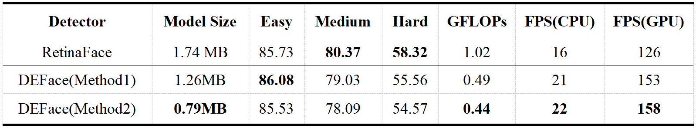

# DEFace

#### 介绍
DEFace：一款超轻量级人脸检测器（CNN-based & Anchor-based & Single-stage & Single-level）

#### 模型结构
- 轻量化CNN结构，单阶段(Single-stage)方式 + 单层级(Single-level)特征
- Backbone：MobileNetV1-0.25
- Feature Fusion：Method1(C5<2×Up> + C4，Default)；Method2(Only C4)
- Dilated Encoder：来自YOLOF，用于丰富语义信息
- Head：3个多任务分支，可同时预测人脸分类、人脸边框和面部标记点(双眼+鼻子)结果

#### 性能对比
- 训练细节：WIDER FACE数据集，SGD Optimizer，300Epochs
- 测试设备：Windows10 PC，Intel Core i5-10500 CPU & NVIDIA GTX-1660s GPU
- 分析评估：模型容量 & 运算量显著下降，检测速度进一步提升；Easy & Medium子集的AP损失较小，对实际应用影响不大

#### 检测效果
- 对于常规的检测场景，不逊色于RetinaFace，并且检测速度更快、运算量更低
- C++ ONNX部署：相较于.pth预训练模型，容量下降10%，速度提升 **3倍** ！

#### 使用说明
- C++版本：需要OpenCV支持

#### 参与贡献
1.  Fork 本仓库
2.  新建 Feat_xxx 分支
3.  提交代码
4.  新建 Pull Request

